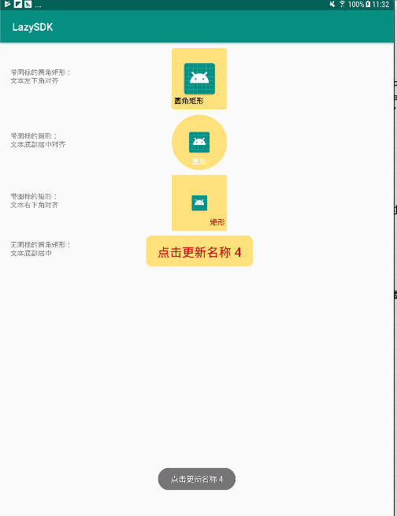

# LazySDK
## Customviews
[](https://bintray.com/lazyboneslz/LazySDK/customviews/_latestVersion)
### ManiButton
自定义button，可以在xml中设置点击效果，但是如果每个button都要按下效果的话，重复添加xml文件烦不胜烦，所以自定义一个MainButton,设置好Button的颜色后，按下效果是对其背景色加深处理，达到点击的效果，感觉世界一下清爽了许多。
###效果预览


###使用说明

* 添加依赖

```
implemention 'com.lazy.sdk:customviews:0.0.1'
```

* 示例

```
    <androidx.constraintlayout.widget.ConstraintLayout
            android:layout_width="match_parent"
            android:layout_height="wrap_content">
        <TextView android:layout_width="wrap_content"
                  android:layout_height="wrap_content"
                  app:layout_constraintLeft_toLeftOf="parent"
                  app:layout_constraintTop_toTopOf="parent"
                  app:layout_constraintBottom_toBottomOf="parent"
                  android:layout_marginLeft="20dp"
                  android:text="带图标的矩形：\n文本右下角对齐"/>
        <com.lazy.customviews.MainButton
                android:id="@+id/btnRect"
                android:layout_width="108dp"
                android:layout_height="108dp"
                app:mainBtnBgColor="#FFDE6D"
                app:mainBtnIcon="@mipmap/ic_launcher"
                app:mainBtnIconRate="4.0"
                app:mainBtnRadius="0dp"
                app:mainBtnText="矩形"
                app:mainBtnTextSize="15sp"
                app:mainBtnTextColor="@android:color/holo_red_dark"
                app:mainBtnTextAlign="right_bottom"
                app:layout_constraintRight_toRightOf="parent"
                app:layout_constraintLeft_toLeftOf="parent"
                app:layout_constraintTop_toTopOf="parent"
                android:layout_marginStart="10dp"
                android:layout_marginLeft="10dp"
                android:layout_marginTop="10dp"/>
    </androidx.constraintlayout.widget.ConstraintLayout>
   
```
* 自定义参数说明

  * app:mainBtnBgColor 

  ```
  按钮背景色：#FFDE6D 或@color/colorRed
  ```
  * app:mainBtnIcon 

  ```
  按钮图标："@mipmap/ic_launcher"，如果不需要，不设置该参数
  ```
  * app:mainBtnIconRate 

  ```
  按钮图标比例：float型，表示图标占整个按钮的几分之几，4.0 表示 1/4.0
  ```
  * app:mainBtnRadius 

  ```
  按钮圆角弧度：单位dp
  ```
  * app:mainBtnText 

  ```
  按钮title
  ```
  * app:mainBtnTextSize 

  ```
  按钮title字体大小：单位sp
  ```
  * app:mainBtnTextColor 

  ```
  按钮文本颜色：#FFDE6D 或者 @android:color/red
  ```
  * app:mainBtnTextAlign 

  ```
  按钮文本对齐方式：
  left_bottom: 左下角对齐
  bottom：底部居中对齐
  right_bottom: 右下角对齐
  center: 居中，在没有icon的情况设置该值 
  ```
  
* 注意事项

  MainButton点击效果是对背景色做颜色加深处理，为了响应touch事件，需要设置OnClickListener才能生效。
  * Kotlin

  ```
  btnRect.setOnClickListener{
  
  }
  ```

